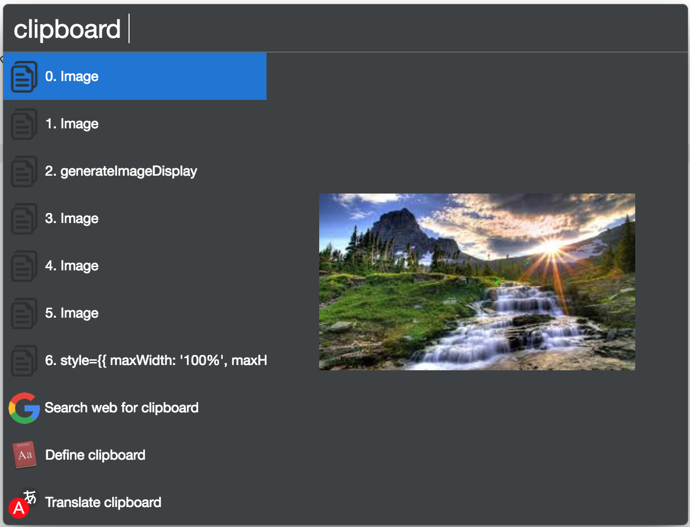

# cerebro-clipboard

> [Cerebro](https://cerebroapp.com) plugin to record and recall list of items on clipboard.

## Usage

In Cerebro, type `clipboard` and any text to filter by; select the item to copy back to the clipboard.

Works with both text, as well as images.

## Installing

* Type `plugins clipboard` into Cerebro
* Click `install`

## Related

- [Cerebro](http://github.com/KELiON/cerebro) – main repo for Cerebro app;

## License

MIT © [Matthew Jacobs](https://www.mattjdev.com)
